# 
#### VMT開発部　赤倉 奈緒

---

## この勉強会でやること

- Kotlinで……
  - 中途採用者向けチュートリアルアプリ(カーセンサー中古車検索アプリ)を作成する
  - ちょっと難しいけど
  - `MVVM` と
  - `DataBinding` と
  - `ViewBinding` も使う

---

## この勉強会でやってほしいこと

- Kotlinちょっとでも覚える
- `MVVM` アーキテクチャに触れる
- ついでにAndroidの `DataBinding` と `ViewBinding` にも触れてみる

---

## アジェンダ

- 用意するもの
- とりあえず完成物の確認
- MVVMアーキテクチャの説明
- `DataBinding` / `ViewBinding` の説明
- 実際のプロジェクトの用意

---

## アジェンダ

- API通信インターフェース (`Repository`) の作成
- 最初のビュー (`MainFragment` / `MainViewModel`) の作成
- 2つめのビュー (`UsedCarDetailFragment` / `UsedCarDetailViewModel`) の作成
- 参考資料等

---

## やることもりもり！

---

## 用意するもの

---

## 用意するもの

### AndroidStudioが動くPC 

- macOSでも
- Windowsでも
- お好きなLinuxでも
- AndroidStudioが動けばなんでもいいです
- `AVD Manager` も動ける環境が好ましいです(OR 実機でデバッグだ)

---

## 用意するもの

### AndroidStudio

- `AVD Manager` でデバッグ用のエミュレートマシンも用意しておくとGOODですね！

---

## 用意するもの

### デバッグ用実機またはエミュレートマシン

- `AVD Manager` で用意できます！

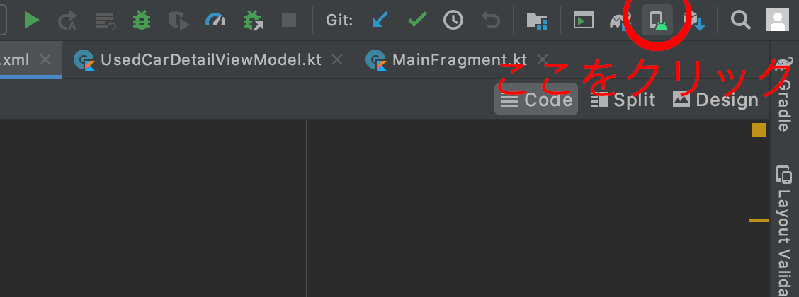

---

## 用意するもの

### デバッグ用実機またはエミュレートマシン

- `AVD Manager` で用意できます！

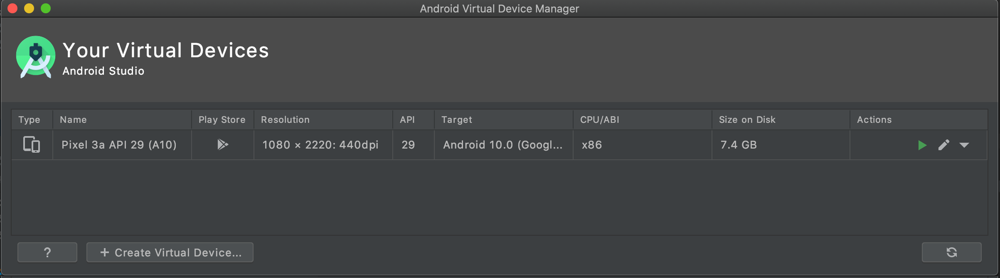

---

## 用意するもの

### カーセンサーAPIアクセス用トークンの取得
- 以下から登録を行っておいてください
  - https://webservice.recruit.co.jp/register/ 
- 忘れた方は ~~-仕方なく~~ 赤倉の持っているIDを配布しますので、しばらくお待ちください

---

## とりあえず完成物の確認

---

## とりあえず完成物の確認

- こちらにすでに作成済みのアプリが存在しています

- よろしければ、どのようなコードなのか、どのような挙動をするアプリなのかをチェックしてみてください

https://github.com/cocoalix/CarsensorApp

---

## MVVMアーキテクチャの説明

---

## MVVMアーキテクチャの説明

### MVVMアーキテクチャとは

- Model-View-ViewModel Architecture
- GUIアプリケーションの実装手法のひとつ
- MVCの派生パターンであり「プレゼンテーションとドメインを分離」する
  - この手法によってアプリケーション開発における保守性・開発生産性に寄与する

---

### MVVMアーキテクチャとは

#### Model

- アプリケーションの ドメイン(問題領域) を取り扱う
- そのアプリケーションが扱う領域のデータと手続き(ビジネスロジック)を表現する要素
  - ビジネスロジック(ショッピングの合計額や送料を計算するなど）

---

### MVVMアーキテクチャとは

#### Model

- 多くのアプリケーションではDBアクセスやサーバ側との通信ロジックなどが含まれている
- MVVMの概念ではMVCの概念と同様に、データの（UI以外の）入出力は取り扱わないので、強いて言うならばそれらはModelの中に隠蔽されると考えられる

---

### MVVMアーキテクチャとは

#### Model

- 一般的にModelはドメインを担当すると言われるがこの言葉だけをもってModelの役割を想像するのは難しい
- Modelの役割は、後述するViewとViewModelの役割以外の部分と考えるのが妥当

---

### MVVMアーキテクチャとは

#### View

- アプリケーションの扱うデータをユーザーが見るのに適した形で表示し、ユーザーからの入力を受け取る要素
- すなわちUIへの入力とUIからの出力を担当する
- 後述するViewModelに含まれたデータをデータバインディング機構のようなものを通じて自動的に描画するだけで自身の役割を果たす
- Viewそのものに複雑なロジックと状態を持たないのがMVVMのViewの特徴

---

### MVVMアーキテクチャとは

#### ViewModel

- Viewを描画するための状態の保持と、Viewから受け取った入力を適切な形に変換してModelに伝達する役目を持つ
- すなわちViewとModelの間の情報の伝達と、Viewのための状態保持のみを役割とする要素である
  - e.g. ドロワーの開閉など

---

### MVVMアーキテクチャとは

#### ViewModel

- Viewとの通信はデータバインディング機構のような仕組みを通じて行うため、ViewModelの変更は開発者から見て自動的にViewに反映される

---

## `DataBinding` / `ViewBinding` の説明

---

## `DataBinding` / `ViewBinding` の説明

- データバインディングは、データと対象を結びつけ、データあるいは対象の変更を暗示的にもう一方の変更へ反映すること、それを実現する仕組みのこと

---

## `DataBinding` / `ViewBinding` の説明

- データバインディングには変更反映の方向性によって以下の2種類が存在する
  - 方向バインディング(1way): data ⇒ target あるいは target ⇒ data のみの一方向な暗示的反映
  - 双方向バインディング(2way): data ⇔ target の双方向な暗示的反映

---

### ※ここまでWikipedia調べ🤐

---

### MVVMパターン図解

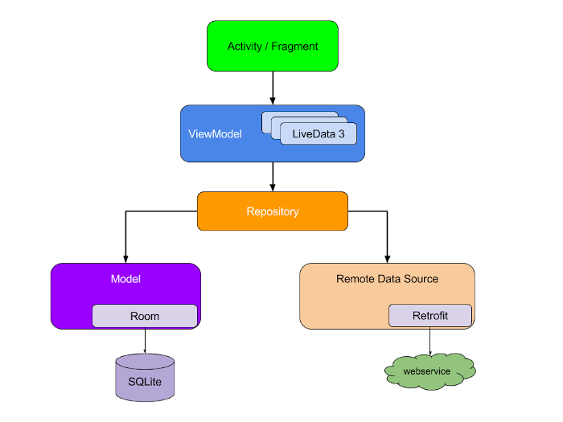

---

## 実際のプロジェクトの用意

---

## 実際のプロジェクトの用意

- まずはオモムロにプロジェクトを作成します

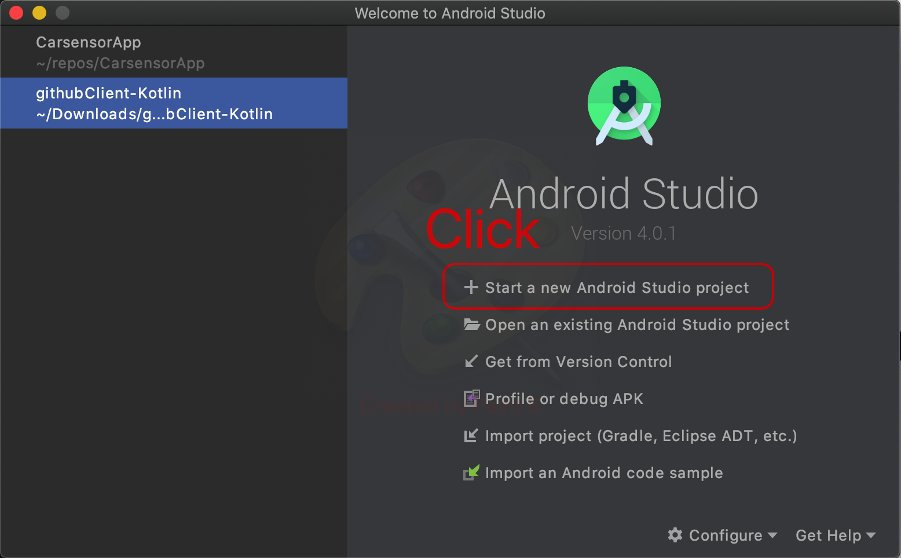

---

## 実際のプロジェクトの用意

- まずはオモムロにプロジェクトを作成します

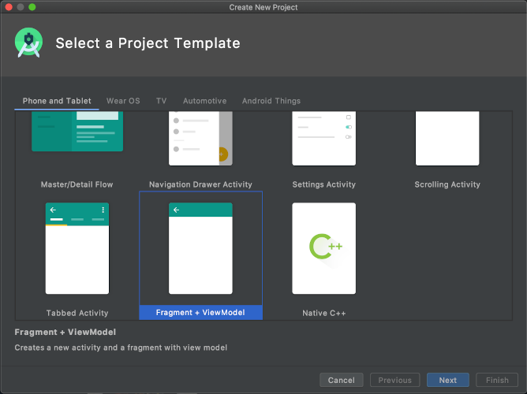

---

## 実際のプロジェクトの用意

- まずはオモムロにプロジェクトを作成します

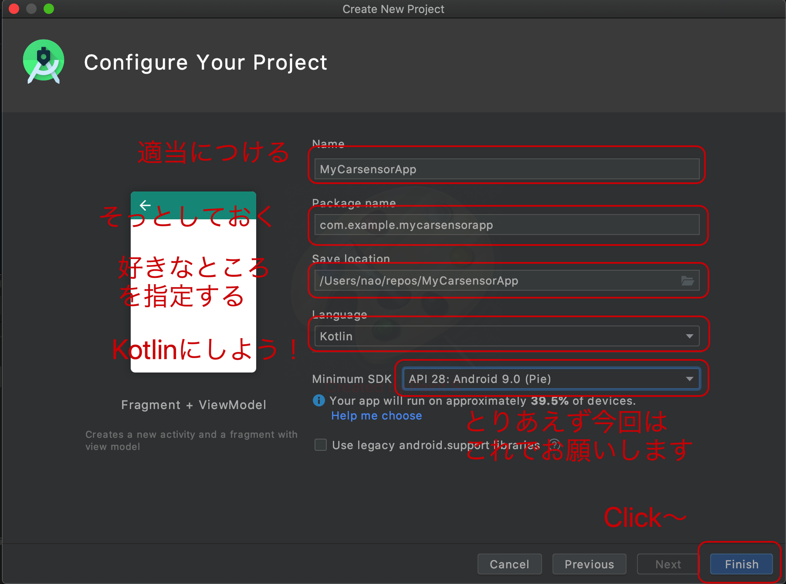

---

## 実際のプロジェクトの用意

- ここまでひとまずできればOK

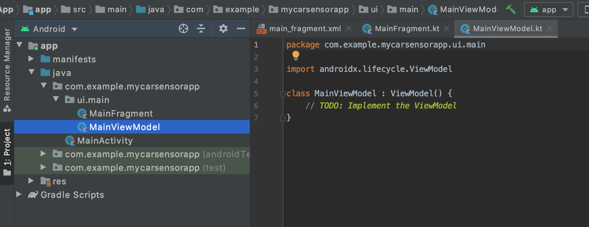

---

## 実際のプロジェクトの用意

- これもやっておいてください(その1)。。

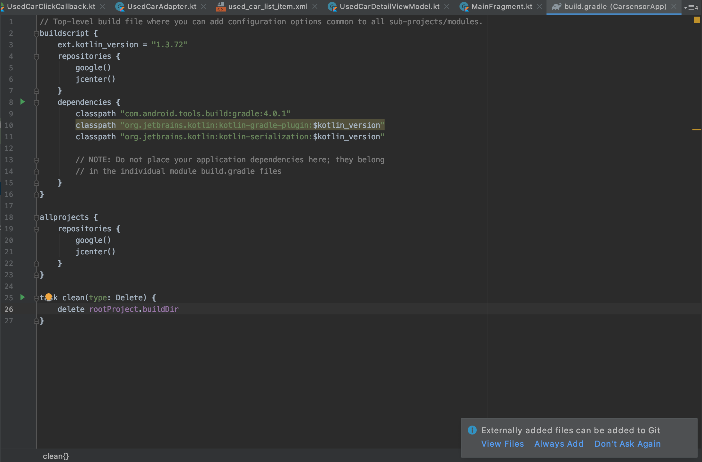

---

### これもやっておいてください(その1)

- build.gradle(Project)に対して
  - dependenciesに以下を追加

```gradle
// @Serializableを有効
classpath "org.jetbrains.kotlin:kotlin-serialization:$kotlin_version"
```

---

## 実際のプロジェクトの用意

- これもやっておいてください(その2)。。

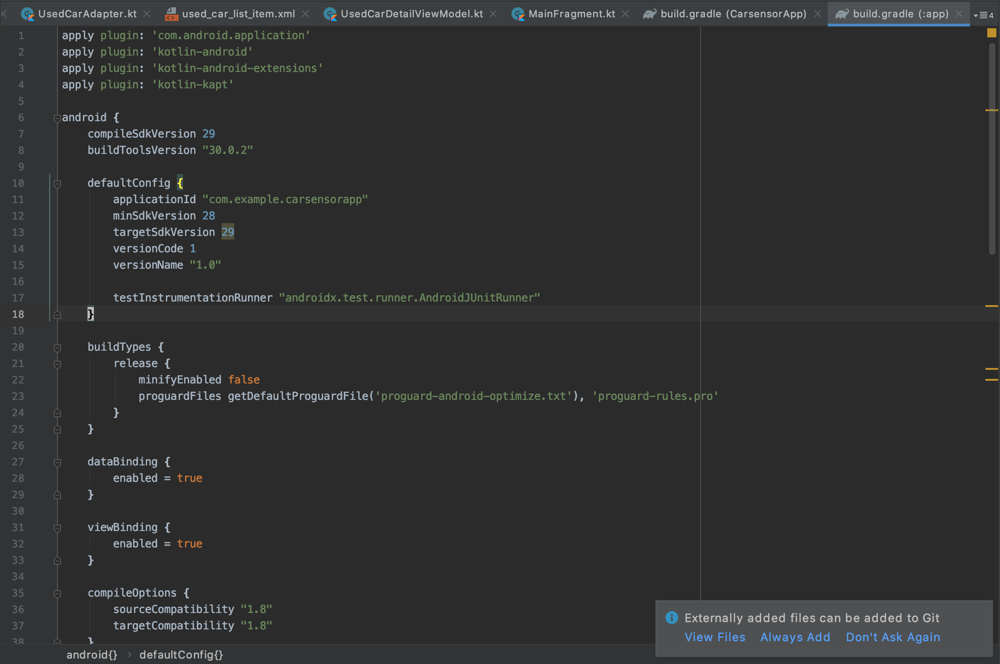

---

### これもやっておいてください(その2)

- build.gradle(App)に対して
  - 一番上に以下を追加

```gradle
apply plugin: 'com.android.application'
apply plugin: 'kotlin-android'
apply plugin: 'kotlin-android-extensions'
apply plugin: 'kotlin-kapt'
```

---

### これもやっておいてください(その2)

- build.gradle(App)に対して
  - android に以下を追加

```gradle
// データバインディング/ビューバインディングの有効化
dataBinding {
  enabled = true
}
viewBinding {
  enabled = true
}
// 使用するJDKのバージョンを1.8にあげる
combileOptions {
  sourceCompatibility "1.8"
  targetCompatibility "1.8"
}
kotlinOptions {
  jvmTarget = "1.8"
}

```

---

### これもやっておいてください(その2)

- build.gradle(App)に対して
  - dependencies に以下を追加

```gradle
implementation fileTree(dir: "libs", include: ["*.jar"])
implementation "org.jetbrains.kotlin:kotlin-stdlib:$kotlin_version"
implementation 'androidx.core:core-ktx:1.3.1'
implementation 'androidx.appcompat:appcompat:1.2.0'
implementation 'androidx.constraintlayout:constraintlayout:2.0.1'
implementation 'androidx.lifecycle:lifecycle-extensions:2.2.0'
implementation 'androidx.lifecycle:lifecycle-viewmodel-ktx:2.2.0'
implementation 'androidx.legacy:legacy-support-v4:1.0.0'
implementation "androidx.fragment:fragment-ktx:1.2.5"
testImplementation 'junit:junit:4.12'
androidTestImplementation 'androidx.test.ext:junit:1.1.2'
androidTestImplementation 'androidx.test.espresso:espresso-core:3.3.0'
implementation "org.jetbrains.kotlinx:kotlinx-serialization-runtime:0.10.0"

implementation "org.jetbrains.kotlin:kotlin-reflect:$kotlin_version"

//layout
implementation 'androidx.appcompat:appcompat:1.2.0'
implementation 'com.google.android.material:material:1.2.1'
implementation 'androidx.constraintlayout:constraintlayout:2.0.1'
implementation 'androidx.cardview:cardview:1.0.0'
implementation 'androidx.recyclerview:recyclerview:1.1.0'

// retrofit
implementation 'com.squareup.retrofit2:retrofit:2.6.0'

// moshi
def moshi_version = "1.5.0"
implementation "com.squareup.moshi:moshi:$moshi_version"
implementation "com.squareup.moshi:moshi-kotlin:$moshi_version"
implementation "com.squareup.retrofit2:converter-moshi:2.4.0"

// Android Architecture Components
implementation 'androidx.lifecycle:lifecycle-extensions:2.2.0'
implementation 'androidx.lifecycle:lifecycle-runtime:2.2.0'
annotationProcessor 'androidx.lifecycle:lifecycle-common-java8:2.2.0'

//viewmodel-ktx viewModelScopeを使うため
implementation "androidx.lifecycle:lifecycle-viewmodel-ktx:2.2.0"

// OkHttp
implementation "com.squareup.okhttp3:okhttp:3.12.11"
implementation "com.squareup.okhttp3:logging-interceptor:3.12.1"
implementation "org.jetbrains.kotlin:kotlin-stdlib-jdk7:$kotlin_version"

//Kotlin Coroutines
implementation "org.jetbrains.kotlinx:kotlinx-coroutines-core:1.3.7"
implementation "org.jetbrains.kotlinx:kotlinx-coroutines-android:1.3.7"

// glide
implementation 'com.github.bumptech.glide:glide:4.9.0'
annotationProcessor 'com.github.bumptech.glide:compiler:4.9.0'

kapt "com.android.databinding:compiler:3.1.4"
```

---

### これもやっておいてください(その2)

#### 正直いちいち手入力するのめんどいので配布します

- なんならスライド内に収まっていない
- コピペしてください

---

### これもやっておいてください(その3)

- AndroidManifest.xmlに
  - `</application>`の下あたりに以下を追加

```xml
<uses-permission android:name="android.permission.INTERNET"/>
<uses-permission android:name="android.permission.ACCESS_NETWORK_STATE"/>
```

---

### Gradle Syncing Time


---

### Kotlin (+DataBinding) デバッグの心得

- (よくわからないエラーが多いけど)折れない
- (よくわからないエラーが多いけど)逃げない
- よくわからないエラー(`HogeFugaBindingImpl` のシンボルが解決できません) が出たら、まずView(xml)の実装を疑おう
  - 設定しているプロパティが無いとかでも平気で `BindingImpl` のコンパイルをミスりやがってコンパイル時エラーを吐きやがる。。。

---

## API通信インターフェース (`Repository`) の作成

---

### Repository #とは

---

### Repository #とは

- ViewModelから実行されるデータの取得部分


---

## API通信インターフェース (`Repository`) の作成

- まずPackageを作る

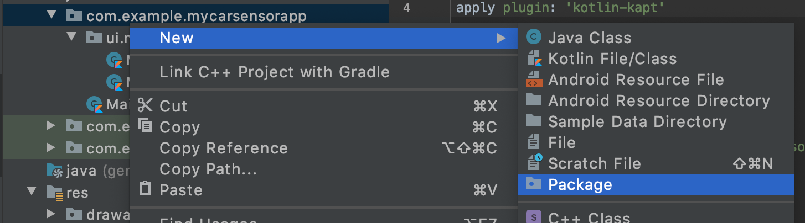

---

## API通信インターフェース (`Repository`) の作成

- まずPackageを作る

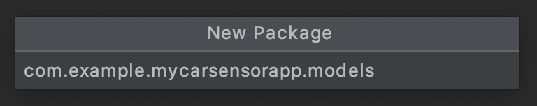
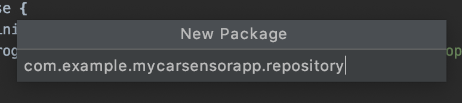

---

## API通信インターフェース (`Repository`) の作成

- RecruitAPIを元にレスポンス用のモデルを用意する
  - https://webservice.recruit.co.jp/doc/carsensor/reference.html#a1to

---

## API通信インターフェース (`Repository`) の作成

- RecruitAPIを元にレスポンス用のモデルを用意する
  - これやってるだけで2時間余裕で~~潰した~~潰れるので、配布します
  - `models` 以下に配置してください
  - `package` あたりは適宜変更しておいてください

---

### `data class` #とは

- クラス定義の方法のひとつ
- `data class` を使用すると、以下が自動的に定義される
  - `equals()` / `hashCode()` のペア：オブジェクトの比較の際に使用
  - プロパティも含んだ形式の `toString()` メソッド：次節で例示
  - `componentN()` メソッド：宣言した順番でプロパティを取り出すことができるメソッド
  - `copy()` メソッド：完全に別のインスタンスとして、そのオブジェクトと全く同じオブジェクトを作成するメソッド


---

## API通信インターフェース (`Repository`) の作成

- 定数クラスを作成する

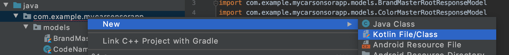
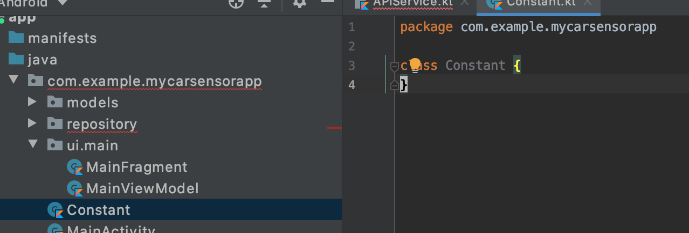

---

## API通信インターフェース (`Repository`) の作成

- 定数クラスを作成する
  - API_KEYの部分は適宜生成したキーを入れてください

```kotlin
package com.example.mycarsensorapp

class Constant {
    companion object {
        // API通信のベースURL
        const val BASE_URL = "https://webservice.recruit.co.jp/carsensor/"
        // APIアクセス用キー
        const val API_KEY = ""
        // カーセンサーAPIのURL
        const val CARSENSOR_URL = "http://webservice.recruit.co.jp/"
    }
}
```

---

### `companion object` #とは

- `object` キーワードと同じく、Singletonを作成するキーワード
- `object` と異なり、クラスに属します

#### ※Kotlinに `static` は存在しないので、 `static` を使用したい場合は `object` または `companion object` を使用します

---

## API通信インターフェース (`Repository`) の作成

- 通信用インターフェースを作る

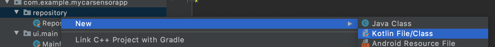

---

## API通信インターフェース (`Repository`) の作成

- 通信用インターフェースを作る

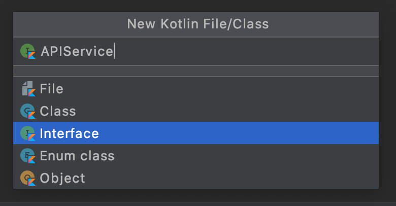

---

## API通信インターフェース (`Repository`) の作成

- 通信用インターフェースを作る
  -  試しにブランドの一覧を取得するものを実装してみましょう
  
```kotlin
interface APIService {
    // APIアクセスするエンドポイントの指定
    @GET("brand/v1/")
    // 引数にリクエストパラメータ、レスポンスには Call<T>を指定すること
    // (Tは任意のレスポンスされたいオブジェクト)
    fun getBrandMaster(
        @Query("key") key: String = Constant.API_KEY,
        @Query("format") format: String = "json"
    ): Call<BrandMasterRootResponseModel>
}
```

---

## API通信インターフェース (`Repository`) の作成

- 通信用リポジトリクラスを作る

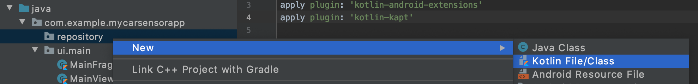
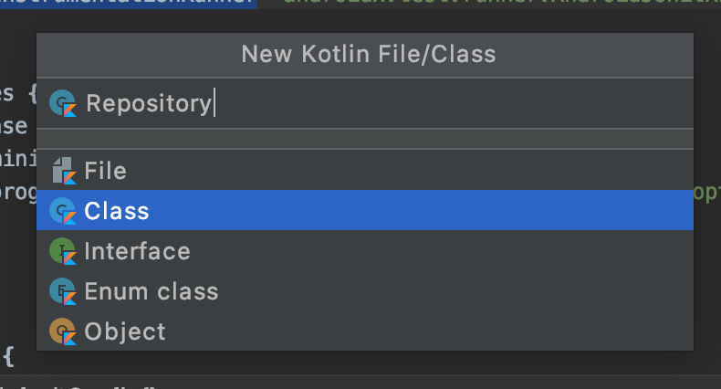

---

## API通信インターフェース (`Repository`) の作成

- 通信用リポジトリクラスを作る

```kotlin
class Repository {
    private val retrofit = Retrofit.Builder()
        .baseUrl(Constant.BASE_URL)
        .addConverterFactory(MoshiConverterFactory.create())
        .build()

    private val service = retrofit.create(ICarsensorAPIService::class.java)
    // 実際にリクエストを行うメソッド
    // 戻り値は先のインターフェースに合わせて必ず Call<T>
    // (Tは任意のレスポンスされたいオブジェクト)
    suspend fun getBrands(): Call<BrandMasterRootResponseModel> = service.getBrandMaster()

    // リポジトリクラスのインスタンス作成
    companion object Factory {
        val instance: Repository
            @Synchronized get() {
                return Repository()
            }
    }
}
```

---

### Retrofit2 #とは

- OkHttp3のレスポンスのラッパー
- コールバックを書きやすくしてくれます
- レスポンスの内容から実際のPOJOに対してORマッピングしてくれたりもしてくれます

---

### `suspend fun` #とは

- Kotlinの非同期処理のひとつ
- この関数定義内の処理は中断される可能性がある
- この関数を使用する際、呼び元は `Scope.launch { ... }` 内(別スレッド)から呼ぶ
  - 別スレッドで呼ぶことができる -> 非同期処理となる

---

## API通信インターフェース (`Repository`) の作成

- 作ったインターフェースを試してみたい。。。！
  - では実際に描画する箇所を作成していきましょう

---

## 最初の View/ViewModel (`MainFragment` / `MainViewModel`) の作成

---

## 最初の View/ViewModel の作成

### 以下の手順で実装していきます

- Viewの作成
- ViewModelの作成
- Spinnerの作成
- 検索ボタンの実装
- 検索結果リストの実装

---


## View/ViewModel の作成

### Viewの作成

- まず、Viewを作成します
- 以下の4つが実装されていればいいです
  - 検索ワードを入れる `EditText`
  - ブランドを選択する `Spinner`
  - 検索ボタンの `Button`
  - 検索結果を表示させる `RecyclerView`

---

## View/ViewModel の作成

### Viewの作成

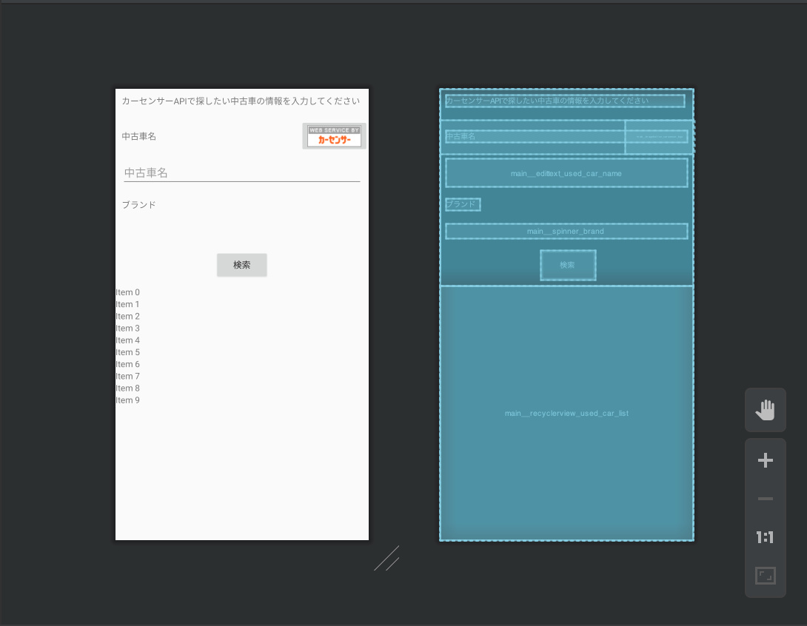

---

## View/ViewModel の作成

###  ViewModelの作成

- ViewModelでは実際の通信処理の実行と、そのレスポンスの保持を行います

---

## View/ViewModel の作成

### ViewModelの作成

- ViewModelは `AndroidViewModel` を継承させましょう
- この時、コンストラクタ引数の名前を `aplication` にすると、 **既存プロパティの名前と競合して謎のコンパイルエラーを引き起こしますので注意**

```kotlin
class MainViewModel(
    private val myApplication: Application
): AndroidViewModel(myApplication) {
```

---

## View/ViewModel の作成

### ViewModelの作成

- まず、実際にデータを取ってくる処理を記述します
  
```kotlin
class MainViewModel(
    private val myApplication: Application
): AndroidViewModel(myApplication) {
    private val _repository = Repository.instance
    var brandsLiveData: MutableLiveData<List<BrandModel>> =
      MutableLiveData()

    init {
        loadLiveData()
    }

    // loadLiveData()
}
```

---

## View/ViewModel の作成

### ViewModelの作成

- まず、実際にデータを取ってくる処理を記述します

```kotlin
    // loadLiveData()
    private fun loadLiveData() {
        viewModelScope.launch(Dispatchers.IO) {
            try {
                val brandsRequest = _repository.getBrands()
                val brandsResponse = brandsRequest.execute()
                if (brandsResponse.isSuccessful) {
                    val mutableBrands = brandsResponse.body()?.results?.brand?.toMutableList()
                    mutableBrands?.add(0, BrandModel("", "< 未選択 >", CodeNamePair("", "")))
                    brandsLiveData.postValue(mutableBrands)
                }
            } catch (ex: Exception) {
                ex.printStackTrace()
            }
        }
    }
```

---

## View/ViewModel の作成

### ViewModelの作成

#### `MutableLiveData<T>`

- 実際のViewに渡したいデータを保持する変数に使用する型

---

## View/ViewModel の作成

### ViewModelの作成

#### `viewModelScope.launch(Dispatchers.IO) { ... }`

- 先ほど説明した、 `suspend` 関数をコールするためのスレッドみたいなものです
- `Dispatchers.IO` を指定することで、メインスレッド(描画スレッド)以外のIOスレッドで実行することを指定しています

---

## View/ViewModel の作成

### Viewの作成

#### Spinner用のAdapterの作成

```kotlin
class BrandArrayAdapter(
    context: Context,
    resource: Int,
    models: List<BrandModel>
) : ArrayAdapter<BrandModel>(context, resource, models) {

    override fun getView(position: Int, convertView: View?, parent: ViewGroup): View {
        val textView = super.getView(position, convertView, parent) as TextView
        textView.text = getItem(position)?.name

        return textView
    }

    override fun getDropDownView(position: Int, convertView: View?, parent: ViewGroup): View {
        val textView = super.getDropDownView(position, convertView, parent) as TextView
        textView.text = getItem(position)?.name

        return textView
    }
}
```

---

## View/ViewModel の作成

### Viewの作成

```kotlin
override fun onViewCreated(view: View, savedInstanceState: Bundle?) {
    super.onViewCreated(view, savedInstanceState)
    viewModel.brandsLiveData.observe(viewLifecycleOwner, Observer { brands ->
        // データが更新されたら、自動的にこの中に入ってくる
        // brands が取得してきたデータ
        brands?.let {
            // SpinnerのAdapterに取ってきたデータと合わせてAdapterをセット
            main__spinner_brand.adapter = context?.let { it1 ->
                BrandArrayAdapter(it1, android.R.layout.simple_spinner_item, brands)
            }
        }
    })
}
```

---

## View/ViewModel の作成

- こんな感じにアプリが実行できればOKです

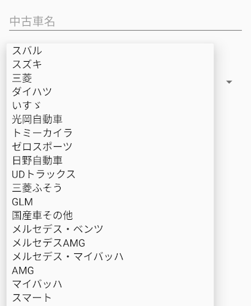

---

## View/ViewModel の作成

### 検索ボタンの実装

- まずRepositoryに中古車検索を追加
  - のでInterfaceに新しい関数を追加する

```kotlin
interface APIService {
    @GET("usedcar/v1/")
    fun getCars(
        @Query("key") key: String = Constant.API_KEY,
        @Query("brand") brand: String,
        @Query("format") format: String = "json"
    ): Call<SearchCarRootResponseModel>
    // :
    // :
}
```

---

## View/ViewModel の作成

### 検索ボタンの実装

- まずRepositoryに中古車検索を追加

```kotlin
class Repository {
    // :
    // :
    suspend fun getCars(
        key: String,
        brand: String,
    ): Call<SearchCarRootResponseModel> = service.getCars(key, brand, "json")
    // :
    // :
}
```

---

## View/ViewModel の作成

### 検索ボタンの実装

- ViewModelで実際に検索APIを叩く関数を実装する

```kotlin
class MainViewModel(
    private val myApplication: Application
): AndroidViewModel(myApplication) {
    // :
    // :
    fun fetchUsedCarLiveData(name: String, brandCode: String) {
        viewModelScope.launch(Dispatchers.IO) {
            try {
                val request = _repository.getCars( Constant.API_KEY, brandCode)
                val response = request.execute()
                if (response.isSuccessful) {
                    carsLiveData.postValue(response.body()?.results?.usedcar)
                }
            } catch (ex: java.lang.Exception) {
                ex.printStackTrace()
            }
        }
    }
    // :
    // :
}
```

---

## View/ViewModel の作成

### 検索ボタンの実装

- 実際に叩くListenerを作る

```kotlin
class MainFragment : Fragment() {
    // :
    // :
    private val onSearchButtonClickListener = View.OnClickListener {
        viewModel.fetchUsedCarLiveData(
            main__edittext_used_car_name.text.toString(),
            (main__spinner_brand.selectedItem as BrandModel).code)
    }
    // :
    // :
}
```

---

## View/ViewModel の作成

### 検索ボタンの実装

- 検索ボタンが叩かれた後、実際にデータを受け取る場所をモック実装でつくる

```kotlin
override fun onViewCreated(view: View, savedInstanceState: Bundle?) {
    super.onViewCreated(view, savedInstanceState)
    viewModel.carsLiveData.observe(viewLifecycleOwner, Observer { cars ->
        cars?.let {
            var message = ""
            for (car in cars) {
                message += car.brand.name + ": " + car.model.toString() + "¥n"
            }
            AlertDialog.Builder(context)
                .setTitle("検索結果")
                .setMessage(message)
                .setPositiveButton("OK"){ dialog, which -> }
                .show()
        }
    })
}
```

---

## View/ViewModel の作成

### 検索ボタンの実装

- Bindingに繋ぎ込む

```kotlin
private lateinit var binding: MainFragmentBinding

override fun onCreateView(inflater: LayoutInflater, container: ViewGroup?,
                          savedInstanceState: Bundle?): View {
    binding = MainFragmentBinding.inflate(inflater, container, false)
    binding.apply {
        onClickSerarch = onSearchButtonClickListener
    }
    return binding.root
}
```

---

## View/ViewModel の作成

### 検索ボタンの実装

- 実際に叩けるように繋ぎ込む

```xml
<data>
    <import type="android.view.View"/>
    <variable name="isOpen" type="boolean" />
    <variable name="isLoading" type="boolean" />
    <variable name="onClickSearch" type="android.view.View.OnClickListener" />

</data>
```

---

## View/ViewModel の作成

### 検索ボタンの実装

- 実際に叩けるように繋ぎ込む

```xml
<!-- 上で指定したonClickSearchをこっちでも指定する -->
<Button
    android:id="@+id/main__button_search"
    android:layout_width="wrap_content"
    android:layout_height="wrap_content"
    android:layout_margin="10dp"
    android:layout_gravity="center"
    android:text="@string/search"
    android:onClick="@{onClickSearch}"
    />
```

---

## View/ViewModel の作成

### 検索ボタンの実装

- 実行するとこうなります

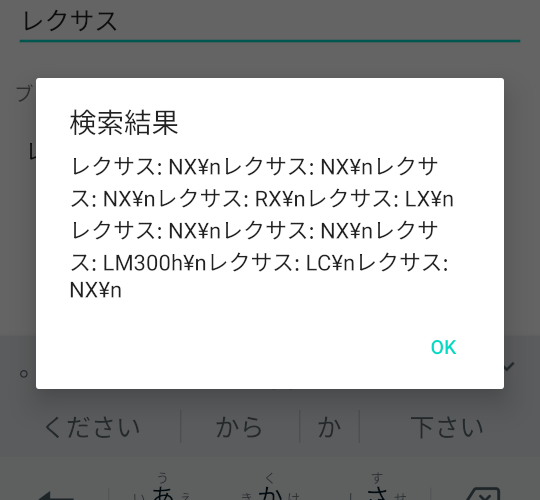

---

## View/ViewModel の作成

### 検索結果リストの実装

- RecylerViewに表示するAdapterを作成します
  - まずはView(xml)から

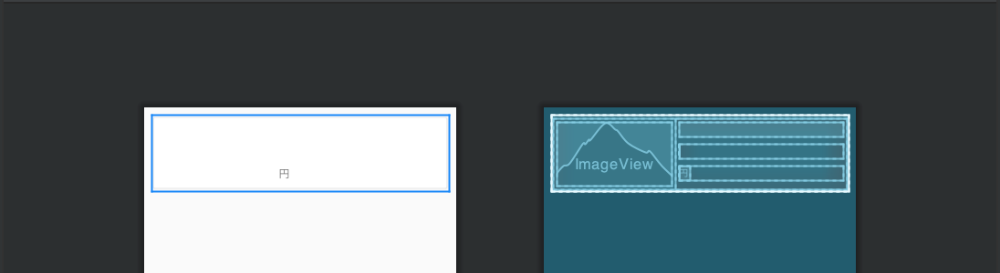

---

## View/ViewModel の作成

### 検索結果リストの実装

- xmlの中身はこのように定義しておきます
  - `<data>` 定義がポイント

```xml
<layout
    xmlns:android="http://schemas.android.com/apk/res/android"
    xmlns:app="http://schemas.android.com/apk/res-auto"
    >

    <data>
        <variable name="usedCar" type="com.example.mycarsensorapp.models.UsedCarModel" />
        <variable name="callback" type="com.example.mycarsensorapp.ui.callbacks.UsedCarClickCallback" />
    </data>
    <!-- : -->
    <!-- : -->
</layout>
```

---

## View/ViewModel の作成

### 検索結果リストの実装

- xmlの中身はこのように定義しておきます
  - onClickのコールバック呼び出しや
  - `app:imageUrl` のようなところで直接モデルの中身を参照させているのがポイント

```xml
    <!-- : -->
    <!-- : -->
        <androidx.cardview.widget.CardView
        android:layout_width="match_parent"
        android:layout_height="100dp"
        android:orientation="horizontal"
        android:onClick="@{() ->  callback.onClick(usedCar)}"
        android:layout_margin="10dp"
        app:cardUseCompatPadding="true">
        <LinearLayout
            android:layout_width="match_parent"
            android:layout_height="match_parent"
            android:onClick="@{() -> callback.onClick(usedCar)}"
            >
            <ImageView
                android:id="@+id/used_car_list_item__imageview_thumbnail"
                android:layout_width="150dp"
                android:layout_height="match_parent"
                android:layout_margin="5dp"
                app:imageUrl="@{usedCar.photo.main.l}"
                />
    <!-- : -->
    <!-- : -->
</layout>
```

---

## View/ViewModel の作成

### 検索結果リストの実装

- ClickCallback(Listener)
  - こんな感じで新たに作成します
  - これで上で定義したxmlのエラーのひとつは解消されているはずです。。。

```kotlin
package com.example.mycarsensorapp.ui.callbacks

import com.example.mycarsensorapp.models.UsedCarModel

interface UsedCarClickCallback {
    fun onClick(usedCarModel: UsedCarModel)
}
```

---

## View/ViewModel の作成

### 検索結果リストの実装

- Adapter
  - 書く分量多すぎるのでこちらは配布します

```kotlin
class UsedCarAdapter(
    private val usedCarClickCallback: UsedCarClickCallback
) : RecyclerView.Adapter<UsedCarAdapter.UsedCarViewHolder>() {

    private var _usedCars: List<UsedCarModel>? = null

    fun setUsedCars(usedCars: List<UsedCarModel>) {

        if (this._usedCars == null) {
            this._usedCars = usedCars

            notifyItemRangeInserted(0, usedCars.size)

        } else {

            val result = DiffUtil.calculateDiff(object : DiffUtil.Callback() {
                override fun getOldListSize(): Int {
                    return requireNotNull(this@UsedCarAdapter._usedCars).size
                }

                override fun getNewListSize(): Int {
                    return usedCars.size
                }

                override fun areItemsTheSame(oldItemPosition: Int, newItemPosition: Int): Boolean {
                    val oldList = this@UsedCarAdapter._usedCars
                    return oldList?.get(oldItemPosition)?.model == usedCars[newItemPosition].model
                }

                override fun areContentsTheSame(oldItemPosition: Int, newItemPosition: Int): Boolean {
                    val old = this@UsedCarAdapter._usedCars!![oldItemPosition]
                    val new = this@UsedCarAdapter._usedCars!![newItemPosition]
                    return old.model?.contentEquals(new.model)
                }
            })
            this._usedCars = usedCars

            result.dispatchUpdatesTo(this)
        }
    }

    override fun onCreateViewHolder(parent: ViewGroup, viewtype: Int): UsedCarViewHolder {
        val binding =
            DataBindingUtil.inflate(
                LayoutInflater.from(parent.context),
                R.layout.used_car_list_item,
                parent,
                false
            ) as UsedCarListItemBinding

        binding.callback = usedCarClickCallback

        return UsedCarViewHolder(binding)
    }

    override fun onBindViewHolder(holder: UsedCarViewHolder, position: Int) {
        holder.binding.usedCar = _usedCars?.get(position)
        holder.binding.executePendingBindings()
    }

    override fun getItemCount(): Int {
        return _usedCars?.size ?: 0
    }

    open class UsedCarViewHolder(val binding: UsedCarListItemBinding) : RecyclerView.ViewHolder(binding.root)
}
```

---

## View/ViewModel の作成

### 検索結果リストの実装

#### UsedCarAdapterの解説

- 初回のアダプター作成時はそのまま代入します
- `notifyItemRangeInserted(...)` でアイテムが追加されたことを通知します

```kotlin
if (this._usedCars == null) {
    this._usedCars = usedCars

    notifyItemRangeInserted(0, usedCars.size)
    // :
    // :
}
```

---

## View/ViewModel の作成

### 検索結果リストの実装

#### UsedCarAdapterの解説

- `getOldListSize`
  - 現在のリストサイズを返却させます
- `getNewListSize`
  - 新しいリストサイズを返却させます

```kotlin
val result = DiffUtil.calculateDiff(object : DiffUtil.Callback() {
    override fun getOldListSize(): Int {
        return requireNotNull(this@UsedCarAdapter._usedCars).size
    }

    override fun getNewListSize(): Int {
        return usedCars.size
    }
    // :
    // :
})
```

---

## View/ViewModel の作成

### 検索結果リストの実装

#### UsedCarAdapterの解説

- `areItemTheSame`
  - 現在のリストと新しいリストの各オブジェクト(index指定有り)のポインタを比較して同一かどうかを返します
- `areContentsTheSame`
  - 現在のリストと新しいリストの各オブジェクト(index指定有り)の実際のプロパティの値を比較して同一かどうかを返します

```kotlin
val result = DiffUtil.calculateDiff(object : DiffUtil.Callback() {
    // :
    // :
    override fun areItemsTheSame(oldItemPosition: Int, newItemPosition: Int): Boolean {
        val oldList = this@UsedCarAdapter._usedCars
        return oldList?.get(oldItemPosition)?.model == usedCars[newItemPosition].model
    }

    override fun areContentsTheSame(oldItemPosition: Int, newItemPosition: Int): Boolean {
        val old = this@UsedCarAdapter._usedCars!![oldItemPosition]
        val new = this@UsedCarAdapter._usedCars!![newItemPosition]
        return old.model?.contentEquals(new.model)
    }
})
```

---

## View/ViewModel の作成

### 検索結果リストの実装

#### UsedCarAdapterの解説

- `result.disaptchUpdatesTo(this)`
  - Adapterへリストの更新を通知します

```kotlin
result.dispatchUpdatesTo(this)
```

---

## View/ViewModel の作成

### 検索結果リストの実装

#### UsedCarAdapterの解説

- `onCreateViewHolder(...)`
  - RecyclerViewのライフサイクルメソッドのひとつです
  - まずbindingを取ってきて
  - callback関数をセットしてやる(後述する自作ClickListener)
  - 後述する `UsedCarViewHolder` のインスタンスを返すようにします

```kotlin
override fun onCreateViewHolder(parent: ViewGroup, viewtype: Int): UsedCarViewHolder {
    val binding =
        DataBindingUtil.inflate(
            LayoutInflater.from(parent.context),
            R.layout.used_car_list_item,
            parent,
            false
        ) as UsedCarListItemBinding

    binding.callback = usedCarClickCallback

    return UsedCarViewHolder(binding)
}
```

---

## View/ViewModel の作成

### 検索結果リストの実装

#### UsedCarAdapterの解説

- `onBindViewHolder(...)`
  - RecyclerViewのライフサイクルメソッドのひとつです
  - RecyclerViewの各アイテムの描画更新を担います
  - xml側でインスタンスの内容の描画指定を行っているので、ここでは `UsedCarModel` のインスタンスを渡すだけにします
- `getItemCount()`
  - RecyclerViewのライフサイクルメソッドのひとつです
  - 現在のリストのサイズを返してやればOK

```kotlin
override fun onBindViewHolder(holder: UsedCarViewHolder, position: Int) {
    holder.binding.usedCar = _usedCars?.get(position)
    holder.binding.executePendingBindings()
}

override fun getItemCount(): Int {
    return _usedCars?.size ?: 0
}
```

---

## View/ViewModel の作成

### 検索結果リストの実装

#### UsedCarAdapterの解説

- `open` アノテーションは「継承可能」を意味します
- このクラスでは `RecyclerView.ViewHolder` を継承していますが
- コンストラクタのsuperに引数の `binding` のメンバ `root` を渡しています
- これで `UsedCarAdapter` の準備はOK

```kotlin
open class UsedCarViewHolder(val binding: UsedCarListItemBinding) : RecyclerView.ViewHolder(binding.root)
```

---

## View/ViewModel の作成

### 検索結果リストの実装

#### Viewの実装

- MainFragmentに以下を実装します
  - RecyclerViewがタップされた時の挙動です

```kotlin
private val usedCarRecyclerViewAdapter = UsedCarAdapter(object : UsedCarClickCallback {
    override fun onClick(usedCarModel: UsedCarModel) {
        if (lifecycle.currentState.isAtLeast(Lifecycle.State.STARTED) && activity is MainActivity) {
            AlertDialog.Builder(context)
                       .setTitle("タップしたもの")
                       .setMessage(usedCarModel.model)
                       .setPositiveButton("OK"){ dialog, which -> }
                       .show()

        }
    }
})
```

---

## View/ViewModel の作成

### 検索結果リストの実装

#### Viewの実装

- MainFragmentに以下を実装します
  - 既存の実装を変更します

```kotlin
viewModel.carsLiveData.observe(viewLifecycleOwner, Observer { cars ->
    cars?.let {
        usedCarRecyclerViewAdapter.setUsedCars(cars)
    }
})
```

---

## View/ViewModel の作成

### 検索結果リストの実装

#### Viewの実装

- `ImageViewExtension` を実装します
  - 忘れると謎のエラーで死にます

```kotlin
package com.example.mycarsensorapp.ui.extensions

import android.widget.ImageView
import androidx.databinding.BindingAdapter
import com.bumptech.glide.Glide

class ImageViewExtension {
    companion object {
        @JvmStatic
        @BindingAdapter("imageUrl")
        fun ImageView.loadImage(imageUrl: String?) {
            if (imageUrl == null) {
                return
            }
            Glide.with(this).load(imageUrl).into(this)
        }
    }
}
```

---

## View/ViewModel の作成

### 検索結果リストの実装

- いざ実行！

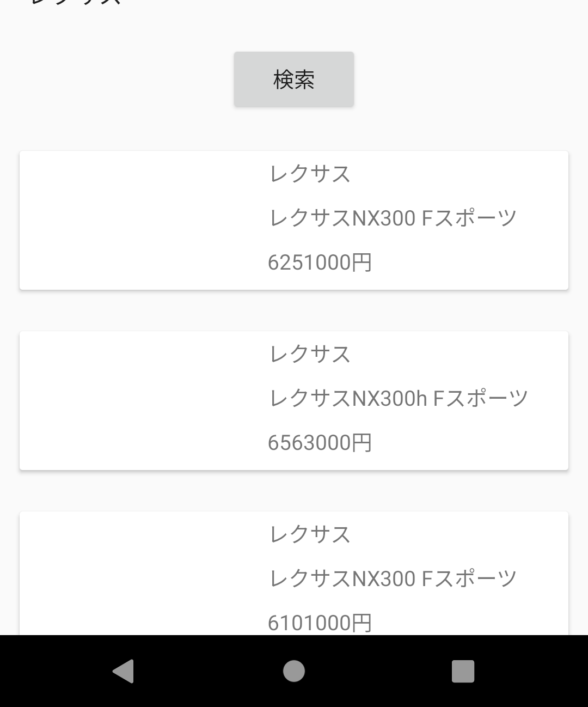

---

## View/ViewModel の作成

### 検索結果リストの実装

- 画像が表示してくれない
  - カーセンサーAPIが返す画像のURLがHTTPであるため
    - ClearText対応が必要

---

## View/ViewModel の作成

### 検索結果リストの実装

#### AndroidManifestの修正

```xml
    <application
        android:allowBackup="true"
        android:icon="@mipmap/ic_launcher"
        android:label="@string/app_name"
        android:roundIcon="@mipmap/ic_launcher_round"
        android:supportsRtl="true"
        android:usesCleartextTraffic="true"
        android:theme="@style/AppTheme">

```

---

## View/ViewModel の作成

### 検索結果リストの実装

- いざ実行！


---

## View/ViewModel の作成

### 検索結果リストの実装

- いざ実行！
  - リストもタップしてみましょう！

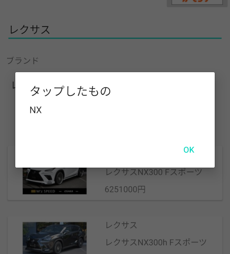

---

## View/ViewModel の作成

### 完成！

---

## View/ViewModel の作成

### 完成......だが、後もう少しつづくんじゃ。。。

---

## 2つめのビュー (`UsedCarDetailFragment` / `UsedCarDetailViewModel`) の作成

---

## 参考資料等

---

## 参考資料等

- [ModelViewViewModel - Wikipedia](https://ja.wikipedia.org/wiki/Model_View_ViewModel)
- [データバインディング - Wikipedia](https://ja.wikipedia.org/wiki/%E3%83%87%E3%83%BC%E3%82%BF%E3%83%90%E3%82%A4%E3%83%B3%E3%83%87%E3%82%A3%E3%83%B3%E3%82%B0)
- [アプリ アーキテクチャ ガイド - AndroidDevelopers](https://developer.android.com/jetpack/guide?hl=ja)
- [Android Architecture Components 初級 （ MVVM + LiveData + Coroutines 編 ）- Qiita](https://qiita.com/Tsutou/items/69a28ebbd69b69e51703#view)

---

## 参考資料等

- [ビュー バインディング - AndroidDeveloper](https://developer.android.com/topic/libraries/view-binding?hl=ja)
- [Butter Knife、今までありがとう。 Data Binding、これからよろしく。](https://qiita.com/izumin5210/items/2784576d86ce6b9b51e6)
- [ビルド時に"エラー:パッケージhogehogetest.databindingは存在しません"とエラーする - teratail](https://teratail.com/questions/52200)

---

## 参考資料等

- [Kotlin Parcelable について - Qiita](https://qiita.com/sadashi/items/fd902619f5b3491e969f)
- [Kotlin スコープ関数 用途まとめ - Qiita](https://qiita.com/ngsw_taro/items/d29e3080d9fc8a38691e)
- [Kotlinのcompanion objectとは - Qiita](https://qiita.com/tkhs0604/items/261e94a42b7097dfd204#:~:text=companion%20object%20%E3%81%AF%E3%82%AF%E3%83%A9%E3%82%B9%E5%86%85,Singleton%E3%81%8C%E4%BD%9C%E6%88%90%E3%81%A7%E3%81%8D%E3%81%BE%E3%81%99%E3%80%82&text=%E3%81%BE%E3%81%9F%E3%80%81%E3%82%AA%E3%83%96%E3%82%B8%E3%82%A7%E3%82%AF%E3%83%88%E5%90%8D%E3%81%AF%E7%9C%81%E7%95%A5,%E3%81%97%E3%81%AA%E3%81%84%E3%81%93%E3%81%A8%E3%81%8C%E3%81%BB%E3%81%A8%E3%82%93%E3%81%A9%E3%81%A7%E3%81%99%E3%80%82)
- [Kotlinのdata class（データクラス）の使い方【初心者向け】 - TechAcademy](https://techacademy.jp/magazine/19797)
- [Kotlin のコルーチン入門](https://mahata.gitlab.io/post/2019-04-23-coroutines-kotlin/)

---

## 参考資料等

- [Fragment の Android-KTX が AAC ViewModel の取得に便利だ](https://qiita.com/mangano-ito/items/9b067916d1374d66b750)
- [Cannot inline bytecode built with JVM target 1.8 into bytecode that is being built with JVM target 1.6. Please specify proper ‘-jvm-target’ option](https://qiita.com/kph7mgb/items/28ee37957976e80e38f219)

---

## 参考資料等

- [AndroidのSpinnerをコードと名称で管理したい時はAdapterを使おう](https://araramistudio.jimdo.com/2018/02/05/android%E3%81%AEspinner%E3%82%92%E3%82%B3%E3%83%BC%E3%83%89%E3%81%A8%E5%90%8D%E7%A7%B0%E3%81%A7%E7%AE%A1%E7%90%86%E3%81%97%E3%81%9F%E3%81%84%E6%99%82%E3%81%AFadapter%E3%82%92%E4%BD%BF%E3%81%8A%E3%81%86/)
- [[Android & Kotlin] プルダウンで項目選択できるSpinnerを設定](https://akira-watson.com/android/kotlin/spinner-simple.html)

---

## ご参加、ありがとうございました

---

## おわり